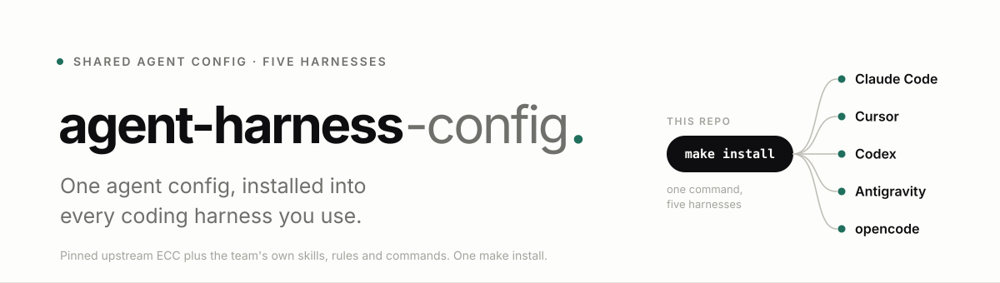
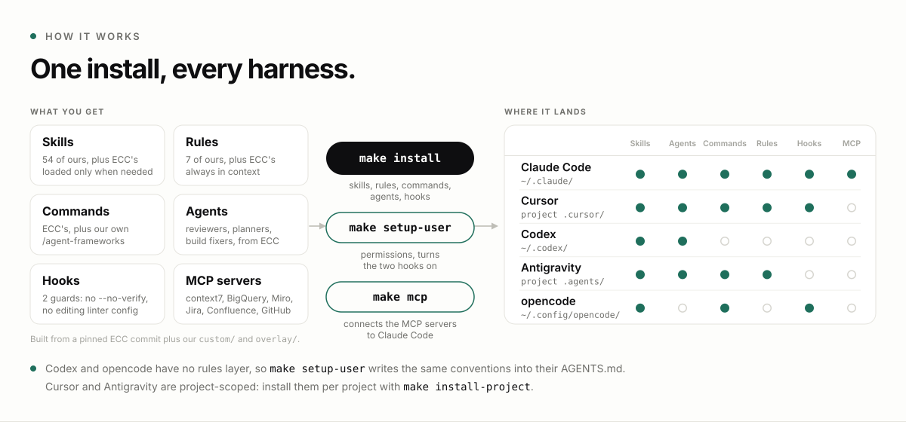
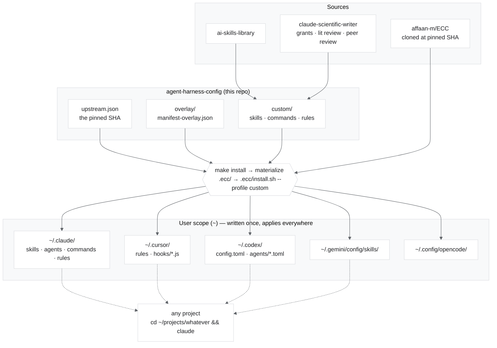
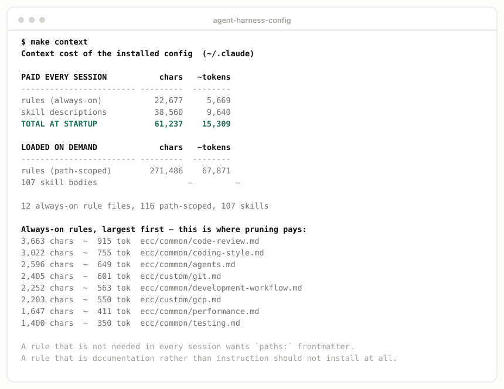
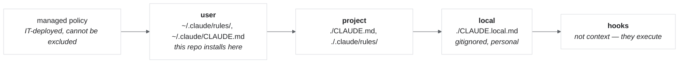

<picture>
  <source media="(prefers-color-scheme: dark)" srcset="docs/assets/banner-dark.svg">
  
</picture>

[](https://github.com/danielvogler/agent-harness-config/actions/workflows/ci.yml)
[](./LICENSE)
[](https://www.python.org/downloads/)
[](https://pre-commit.com/)
[](https://github.com/gitleaks/gitleaks)
[](UPSTREAM.md)

**Install the team's skills, rules and commands once, and every coding agent you use has
them — in every project.**

## Start here

Paste this into Claude Code, Codex or opencode:

```text
Clone https://github.com/danielvogler/agent-harness-config, read its AGENTS.md,
and set it up on this machine.
```

The agent takes it from there. To do it by hand, see [First 10 minutes](#first-10-minutes).

## What this is

Shared agent configuration for the team. Install it once and the same skills, commands and
rules are available in every harness you use — Claude Code, Cursor, Codex, Antigravity,
opencode — and in every project on your machine, with no per-project setup.

The problem it solves is N×M: N repos of team-authored agent content times M harnesses, each
installed by hand, by each person. Miss one and that harness behaves differently, so two people
on the same task get different agent behaviour — and so does one person switching tools
mid-task. Here, a new source repo is a manifest entry instead of another install ritual across
five tools.

This is not about enforcement. Nothing is locked down. The point is that the same capabilities
are *available* everywhere by default, rather than depending on who remembered to install what.

<picture>
  <source media="(prefers-color-scheme: dark)" srcset="docs/assets/how-it-works-dark.svg">
  
</picture>

## First 10 minutes

Three commands. Do them in order.

```bash
git clone git@github.com:danielvogler/agent-harness-config.git
cd agent-harness-config

make install      # 1. copies skills, rules, commands and agents into every tool you use
make setup-user   # 2. turns them on: permissions, two safety hooks, no AI attribution, conventions for Codex
make doctor       # 3. confirms it worked, and tells you if you are out of date later
```

`make install` copies files. **`make setup-user` is what turns them on** — without it you keep
clicking through permission prompts, nothing blocks a destructive command, and Codex and
opencode never see the team conventions. It backs up everything it touches and prints how to
undo. Run `python3 tools/setup-user.py --dry-run` first if you want to see it before it writes.

Optionally, `make mcp` connects five servers: live library docs (context7), read-only
BigQuery, Miro boards, self-hosted Jira and Confluence, and GitHub. See
[`overlay/README.md`](overlay/README.md).

Miro authenticates in the browser and needs nothing from you first. The others read personal
values from `.env`, which is gitignored:

```bash
cp .env.example .env   # then fill in the values for the servers you want
```

`CONFLUENCE_URL` and `CONFLUENCE_TOKEN` are required for the Atlassian server, `JIRA_URL` and
`JIRA_TOKEN` are optional, and tokens come from each system's own profile settings. A variable
exported in your shell wins over `.env`. If your tokens already live in another file, point at
it instead of making a second copy — one copy of a token is one thing to rotate and one thing
to leak:

```bash
make mcp ENV_FILE=../atlassian_agent/.env
```

The Atlassian server speaks to **self-hosted** Jira and Confluence only, not
`*.atlassian.net` Cloud sites. If a value is missing, `make mcp` says so and skips that one
server rather than failing everything.

### Variables

Nothing team- or person-specific is written into a rule or skill, and changing a value needs
no reinstall.

**GCP** uses gcloud's own named configurations, which hold the project and the region. The
`gcp.md` rule has agents read them with `gcloud config get`:

```bash
gcloud config configurations create proj-a
gcloud config set project my-project-id
gcloud config set compute/region europe-west6
gcloud config configurations activate proj-a   # switch at any time
```

To switch per folder, put `export CLOUDSDK_ACTIVE_CONFIG_NAME=proj-a` in an `.envrc` and use
[direnv](https://direnv.net/).

**Everything else** is an environment variable. Set it in your shell (`~/.bashrc` or
`~/.zshrc`), in a file your team shares and everyone sources from there, or in `.env` here
for `make mcp`:

| Variable | Used by | What it is |
| --- | --- | --- |
| `GOOGLE_CLOUD_PROJECT` | BigQuery server | Overrides the gcloud project for `make mcp`; `GCP_PROJECT` also works |
| `CONFLUENCE_URL`, `CONFLUENCE_TOKEN` | Atlassian server | Self-hosted Confluence base URL and personal access token |
| `JIRA_URL`, `JIRA_TOKEN` | Atlassian server | Optional, the same for Jira |
| `GITHUB_PERSONAL_ACCESS_TOKEN` | GitHub server | Fine-grained token, scoped to the repos you use |

MCP servers keep the values they were registered with: after changing one, run
`claude mcp remove <id> -s user` and `make mcp` again.

`make mcp` is idempotent by design: it skips any server `claude mcp list` already shows,
without reconfiguring it. That's a trap for "Confluence first, Jira later" — if you ran
`make mcp` with only `CONFLUENCE_TOKEN` set, then export `JIRA_TOKEN` weeks later expecting
it to be picked up, it won't be; `atlassian-agent` is already registered, so the new token
never reaches it and every `jira_*` tool call fails with `Missing required environment
variable: JIRA_TOKEN`. `make mcp` prints a `[note]` when this happens — a key that would
now resolve but isn't part of the live registration — rather than silently reporting
`already configured`. The fix is to re-register, not to re-check the token:

```bash
claude mcp remove atlassian-agent -s user
make mcp
```

Then go to any project and work as normal. Nothing is per-project; it applies everywhere.

**To check it took:** in a Python repo, ask an agent to add a BigQuery query. It should reach
for `uv` rather than pip, and it should not write a query without `maximum_bytes_billed`. If it
does neither, run `make doctor`.

**Later:** `make update` pulls the latest shared config. `make doctor` tells you when you are
behind. If something looks wrong, run `make doctor` before asking — most answers are "you are
behind, run `make update`".

Where to complain: open an issue on this repo. A convention that annoys you is a bug in the
convention, not in you.

## Architecture

This repo holds the **pin** and **our content**. It does not contain a copy of upstream. At
install time, `tools/materialize.py` clones [ECC](https://github.com/affaan-m/ECC) at the
pinned SHA into a gitignored `.ecc/`, drops `custom/` into it, patches its manifests from our
overlay, and lets ECC's own installer fan everything out.



The key thing: **this repo is build material, not a workspace.** Nobody works inside it. It
writes into `~`, and every harness picks things up from there in every other project.

## Repo layout

```text
agent-harness-config/
├── upstream.json                    ← the pinned upstream SHA, and where custom/ came from
├── overlay/
│   └── manifest-overlay.json        ← our delta to ECC's manifests, applied at install time
├── custom/
│   ├── skills/                      ← 91 skills, vendored + ported
│   ├── commands/                    ← research overlays
│   └── rules/                       ← our conventions: python, gcp, agents
├── tools/
│   ├── materialize.py               ← builds .ecc/ from the pin + custom/ + overlay
│   ├── validate-manifests.py        ← pre-commit gate on the pin and the overlay
│   ├── check-profile.py             ← the custom profile still resolves after materialize
│   ├── context-cost.py              ← what the config costs in context per session
│   └── doctor.py                    ← is what you have installed still current?
├── Makefile                         ← install / update / doctor / context / check / mcp
├── UPSTREAM.md                      ← the pin, every delta, and known issues
├── CHANGELOG.md                     ← what changed between tags
└── .ecc/                            ← gitignored; created by make install
```

## Installation

Prerequisites: `git`, `node` (ECC's installer is Node), `python3`, `make`.

```bash
git clone git@github.com:danielvogler/agent-harness-config.git
cd agent-harness-config
make install
```

That is once per person, per machine. Run `make plan` first if you want to see what it will
write before it writes anything, and `make uninstall` to remove everything it wrote.

### Cursor and Antigravity are project-scoped

ECC installs one harness per invocation, and only **claude, codex and opencode** are user-scoped
("home") targets. Its `cursor` and `antigravity` targets write into the *current working
directory*, not `~`. So the install-once-and-forget promise holds for three of the five; for the
other two you install per project:

```bash
make install-project PROJECT=~/projects/whatever
```

Skills still reach Cursor and Antigravity — they just land in that project's `.cursor/` and
`.agents/` rather than in your home directory.

Thereafter:

```bash
make update
```

which pulls this repo, re-materializes at whatever SHA the pin now names, and reinstalls.

Since the install writes into `~` there is no directory to inspect, so to find out whether yours
is current:

```bash
make doctor
```

It compares the upstream SHA and the content actually installed against this checkout, reports how
far behind `origin/main` you are, and delegates per-file drift to upstream's own doctor. Almost
everything it flags is fixed by `make update`. Run it before reporting that something is broken —
"am I on the current config?" is the first question, and this answers it.

### Finish the install: stop the permission prompts

`make install` never touches `~/.claude/settings.json`. Everything it writes is recorded so
`make uninstall` can reverse exactly that, and your settings file is yours — model, theme, your
own permissions. So this one step is a paste, not a script.

Without it you get a prompt every time an agent wants to run `git status` or
`gcloud ... list`, which trains people to approve without reading — worse for safety than a
tight allowlist. **Everything below is read-only; none of it can create, modify, delete or
spend.** Merge into `permissions.allow` in `~/.claude/settings.json`:

```json
{
  "permissions": {
    "allow": [
      "Bash(git status:*)", "Bash(git log:*)", "Bash(git diff:*)", "Bash(git show:*)",
      "Bash(git branch:*)", "Bash(git remote -v:*)", "Bash(git rev-parse:*)",

      "Bash(gcloud config list:*)", "Bash(gcloud projects list:*)",
      "Bash(gcloud projects describe:*)", "Bash(gcloud compute instances list:*)",
      "Bash(gcloud compute instances describe:*)", "Bash(gcloud storage ls:*)",
      "Bash(gcloud run services list:*)", "Bash(gcloud run services describe:*)",
      "Bash(gcloud logging read:*)", "Bash(gcloud iam service-accounts list:*)",

      "Bash(bq ls:*)", "Bash(bq show:*)", "Bash(bq query --dry_run:*)",

      "Bash(uv run pytest:*)", "Bash(uv run ruff check:*)", "Bash(uv tree:*)",
      "Bash(pre-commit run:*)",

      "Bash(make validate:*)", "Bash(make doctor:*)", "Bash(make context:*)", "Bash(make plan:*)"
    ],
    "deny": [
      "Bash(gcloud * delete:*)", "Bash(bq rm:*)", "Bash(gsutil rm -r:*)",
      "Bash(terraform destroy:*)", "Bash(rm -rf:*)",
      "Read(**/*service-account*.json)", "Read(**/.env)", "Read(**/id_rsa)", "Read(**/id_ed25519)"
    ]
  }
}
```

The `deny` half is not optional. An allowlist alone leaves everything else to a prompt, and a
prompt is a decision made by a tired human at 6pm — `deny` is the only part the client enforces
regardless of what the model or you decide in the moment. It encodes the destructive-operation
rule from [`custom/rules/gcp.md`](custom/rules/gcp.md), which as a rule can only advise. The
`Read` entries stop a credential or private key being pulled into context at all.

> An AgentShield scan flagged exactly this — "no deny list configured" — as its one finding
> that applied to our real setup. Details and its other results are worth reading before
> trusting the tool further.

What is **deliberately absent**, and should stay absent: no bare `Bash(gcloud:*)` or
`Bash(bq:*)` — those would permit `delete` and `rm`, quietly overriding what
[`custom/rules/gcp.md`](custom/rules/gcp.md) requires. No `bq query` without `--dry_run`,
because a real query costs money and that prompt is doing useful work. No `git push`,
`git commit`, `terraform apply`, or `rm`. If you want to widen one, widen the *subcommand*,
never the binary — and use `/permissions` to see what you already allow, or the
`fewer-permission-prompts` skill to generate additions from your own transcripts.

## What gets installed where

Fan-out is **not uniform**, and this is inherent to the harnesses rather than a flaw in the
tooling — Codex has no hook system, so nothing can give it one.

| | Claude | Cursor | Codex | Antigravity | opencode |
| --- | --- | --- | --- | --- | --- |
| **Skills** (`SKILL.md`) | ✅ | ✅ | ✅ | ✅ | ✅ |
| **Agents** | ✅ | ✅ | ✅ | ✅ | ❌ |
| **Commands** | ✅ | ✅ | ❌ | ✅ | ✅ |
| **Rules** | ✅ | ✅ | ❌ | ✅ | ❌ |
| **Hooks** | ✅ | ✅ | ❌ | ❌ | ✅ |

> **Rule of thumb: if it must work in every harness, make it a skill.**

## The four building blocks

Everything this repo installs is one of four things. Choosing the wrong one is the most
common mistake, so here they are in a sentence each:

- **Rule** — *ambient guidance.* Prose loaded into the model's context that shapes how it
  behaves without being asked. Best for standing conventions ("use `uv`, not pip"); it
  advises and can be reasoned around, so it can never guarantee anything.
- **Skill** — *a procedure the model chooses to open.* A folder with a `SKILL.md` (plus
  optional scripts and templates) that stays closed until its one-line description looks
  relevant to the task. Best for know-how too long to keep in context permanently.
- **Command** — *a prompt macro you invoke.* A file you trigger by typing `/name`, which
  pastes a scripted set of instructions into the conversation. Best for repeatable jobs
  you start deliberately, like `/agent-frameworks`.
- **Hook** — *a shell command the harness runs at a fixed event.* Not context at all; it
  executes whether the model likes it or not, and a `PreToolUse` hook exiting `2` blocks
  the tool call outright. The only one of the four that can actually enforce anything.

> **The one-line version:** rules *advise*, skills *inform*, commands *initiate*, hooks
> *enforce*. If it must hold in every harness, make it a skill — that is the only kind all
> five read. If it must actually stop something, it has to be a hook or a pre-commit hook.

## What the agent reads, and when

Not everything installed is in context. This is what makes a 91-skill bundle affordable —
and worth understanding before you add anything:

| What | Loaded | Trigger | Cost on a typical session |
| --- | --- | --- | --- |
| Rule **without** `paths:` frontmatter | Every session | Unconditional | **~6.4k tokens** — always paid |
| Every skill's `name` + `description` | Every session | Unconditional | **~11.4k tokens** — always paid |
| Rule **with** `paths:` frontmatter | On demand | Model reads a matching file | 0 until it matches (~67k available) |
| Skill **body** (+ its scripts) | On demand | Model judges the description relevant, or you name it | 0 until opened |
| **Command** | On demand | You type `/name` | 0 until typed |
| **Hook** | Never in context | Fires on a tool-call event | 0 tokens — it is a subprocess |

Run **`make context`** for the live numbers on your own machine. Note the surprise in the
right-hand column: **skill descriptions cost nearly twice all always-on rules combined.**
Skill *count* is the expensive dimension, not rule length.

<picture>
  <source media="(prefers-color-scheme: dark)" srcset="docs/assets/make-context-dark.svg">
  
</picture>

The output of `make context` on one machine, first part only. Yours will differ.

One free saving while you are here. Upstream's `rules/ecc/README.md` is ~1.4k tokens of
documentation *about* the rules directory, loaded unconditionally in every session because it
has no `paths:` frontmatter — the largest always-on file installed, and it instructs nothing.
Skip it via `~/.claude/settings.json`, then re-run `make context` to see the drop:

```json
{ "claudeMdExcludes": ["**/.claude/rules/ecc/README.md"] }
```

Our own `custom/rules/README.md` is not installed at all, for the same reason.

### Worked example: Claude, in a Python repo

You run `claude` in `~/projects/some-model`, and ask it to add a BigQuery loader.

1. **At startup**, Claude loads `~/.claude/rules/ecc/common/*.md` and our
   `custom/gcp.md` — both unscoped — plus the one-line description of all 91 skills. It
   has *not* read `python.md`, or any skill body.
2. It reads `src/loader.py`. That path matches `python.md`'s `paths: ["**/*.py"]`, so
   **`python.md` enters context now** — uv, ruff, no bare `except`.
3. It decides the `python-testing` skill looks relevant and **opens that skill's body**.
   The other 90 stay shut.
4. It proposes `bq query` without `maximum_bytes_billed`. `gcp.md` was loaded at step 1,
   so it catches itself — this is why that file is deliberately unscoped: a `gcloud` or
   `bq` decision is never a file read, so a scoped rule would arrive too late.
5. You type `/agent-frameworks` to start a research run. **Only now** does that command's text
   enter the conversation.
6. It tries `git commit --no-verify`. No rule stops that reliably — but the
   `block-no-verify` **hook** exits `2` and the tool call never runs. (On a stock install
   that hook is inert; see the warning below.)

### Precedence

Everything is **concatenated, not overridden** — later text wins a direct conflict:



So **a project can always override what this repo installs.** That is intended: the shared
config is a floor, not a ceiling. And the last box sits outside the chain entirely — rules
are text a model can talk itself out of; a hook is a subprocess.

> Diagrams drift faster than prose. When you change what installs where, or how loading
> works, update these in the same PR — a confidently wrong diagram is worse than none.

### Which directory does what

After `make install`, in `~/.claude/` (other harnesses get the subset in the table below):

| Directory | Holds | Read when |
| --- | --- | --- |
| `rules/ecc/common/` | upstream's language-agnostic conventions | every session |
| `rules/ecc/custom/` | **ours** — `python.md`, `gcp.md`, `agents.md` | `gcp.md` every session; the others on matching files |
| `rules/ecc/<lang>/` | 21 upstream language packs, all path-scoped | only in that language |
| `skills/` | 91 ours + upstream's, one folder each | descriptions always; bodies on use |
| `commands/` | `/agent-frameworks`, upstream's | when you type the name |
| `agents/` | subagent definitions | when a subagent is spawned |
| `hooks/hooks.json` | the 21-matcher registry | never — **currently inert**, see below |
| `ecc/install-state.json` | every file the installer wrote | by `make uninstall` and `make doctor` |

In this repo, the mirror of that is `custom/<kind>/` — add a file there and it fans out to
all five harnesses on the next `make update`.

## Modules

The `custom` profile installs these. Upstream modules come from the pinned ECC checkout; ours
come from `custom/`.

| Module | Source | What it provides |
| --- | --- | --- |
| `rules-core` | upstream | Shared conventions plus 21 language rule packs, loaded into context |
| `agents-core` | upstream | Subagent definitions, each carrying a prompt-injection defense block |
| `commands-core` | upstream | The `/`-command library |
| `platform-configs` | upstream | The per-harness translation layer — why one piece of content reaches five tools |
| `workflow-quality` | upstream | TDD, eval-harness, verification-loop and context-budget skills |
| `custom-skills` | ours | 91 skills — 81 from `ai-skills-library`, 8 academic/grant-writing from `claude-scientific-writer`, plus `custom-deep-research` and `paper-search` |
| `custom-research` | ours | `/agent-frameworks`, which drives the `custom-deep-research` pipeline |
| `custom-rules` | ours | Team conventions — Python, GCP and agent-building practice. The delta against upstream's generic, TypeScript-biased rules |
| `hooks-runtime` | upstream | 21 hooks over 7 events — but see the warning below: **they are currently inert** |

Hooks reach Claude, Cursor and opencode only — Codex and Antigravity have no hook system, so
anything that must hold everywhere still has to be a skill. Individual hooks can be switched
off with `ECC_DISABLED_HOOKS=id,id`, or the whole set dialled back with
`ECC_HOOK_PROFILE=minimal`. See [`UPSTREAM.md`](UPSTREAM.md) for the audit behind enabling them.

> ⚠️ **The installed hooks currently do nothing.** ECC writes them to
> `~/.claude/hooks/hooks.json`, but Claude Code only activates hooks declared in a settings
> `"hooks"` key or inside an enabled plugin directory — it does not read that path. So all 21
> are inert on a stock install. `make doctor` reports it. Rules, skills, commands and agents
> are unaffected and work normally; the practical consequence is that **nothing here
> currently blocks anything**, so a convention that must be enforced belongs in that repo's
> `.pre-commit-config.yaml`. Details and the reason it is not yet fixed are in
> [`UPSTREAM.md`](UPSTREAM.md).

Deliberately **not** installed: the `security` module (mostly domain-specific) and 15 modules
removed outright.

Never run `--profile full`.

## Adding to it

The durable part is the pattern, not the current list of sources. Adding one should be a
five-minute edit anyone can do:

- **A skill** — drop a directory containing `SKILL.md` into `custom/skills/` and open a PR.
  Nothing else needs wiring; `custom-skills` already points at that directory.
- **A command** — same, into `custom/commands/`.
- **A rule** — same, into `custom/rules/`.
- **A whole new source repo** — put its content under `custom/<kind>/`, add a module entry to
  `overlay/manifest-overlay.json`, add the module to the `custom` profile, and record the
  source repo and its SHA in `upstream.json`.

`make validate` checks all of it. Run `make setup` once to activate it as a pre-commit hook.
It needs the `pre-commit` CLI on your PATH first: `uv tool install pre-commit`.

If you change a script in `tools/`, run `make test` (after
`pip install -r requirements-dev.txt`). `make check` runs everything CI runs, tests included.
Full contributor guidance is in [`AGENTS.md`](AGENTS.md).

## Updating

`make update` for the shared config. Bumping **upstream** is separate and deliberate: edit the
SHA in `upstream.json`, run `make validate && make plan`, read the diff, commit. Never track
upstream `main` — it takes daily commits. Review monthly.

To release, rename `## [Unreleased]` in `CHANGELOG.md` to `## [vX.Y.Z] — YYYY-MM-DD`, merge,
then push the tag `vX.Y.Z`. CI runs again and the GitHub release takes its notes from that
section; a tag with no matching section fails.

## License

Apache-2.0, as this repo was created. Upstream ECC is MIT and is cloned at install time rather
than redistributed here. Vendored skills in `custom/skills/` keep their own upstream licenses
(Apache-2.0, MPL-2.0, MIT). Their license texts and which skill came from where are in
[`THIRD_PARTY_LICENSES/`](THIRD_PARTY_LICENSES/README.md).

> The original build draft specified an MIT badge, on the assumption this repo would contain a fork of
> MIT-licensed upstream code. It no longer does, so the repo's existing Apache-2.0 license was
> left alone. Switching to MIT is a one-line change if that is what the team wants.
